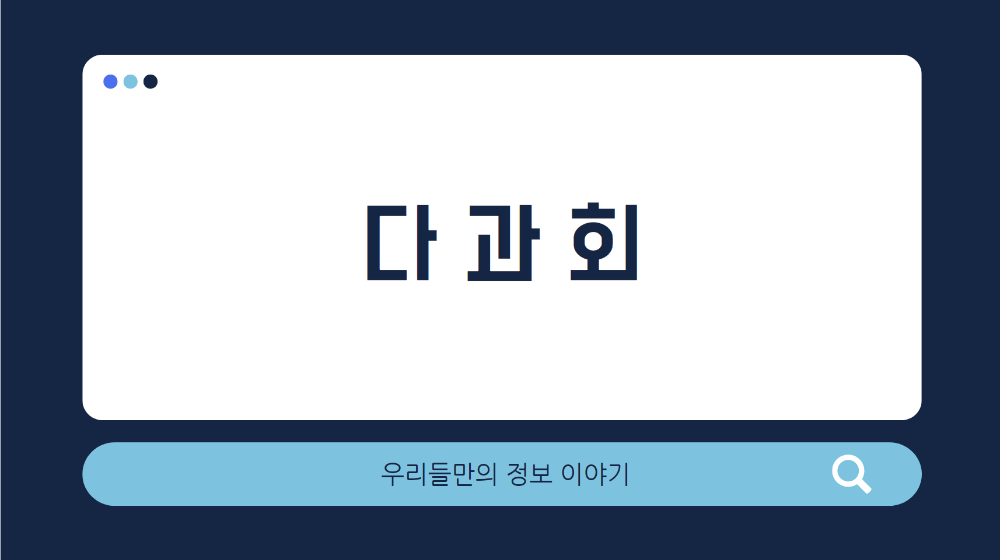
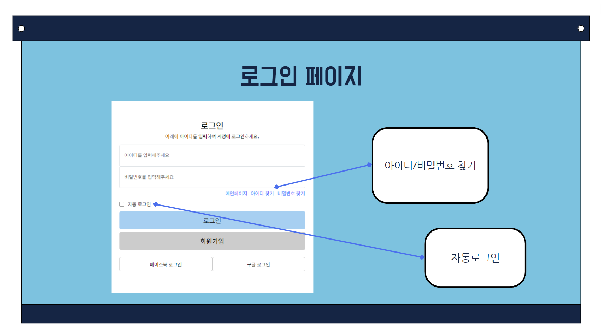
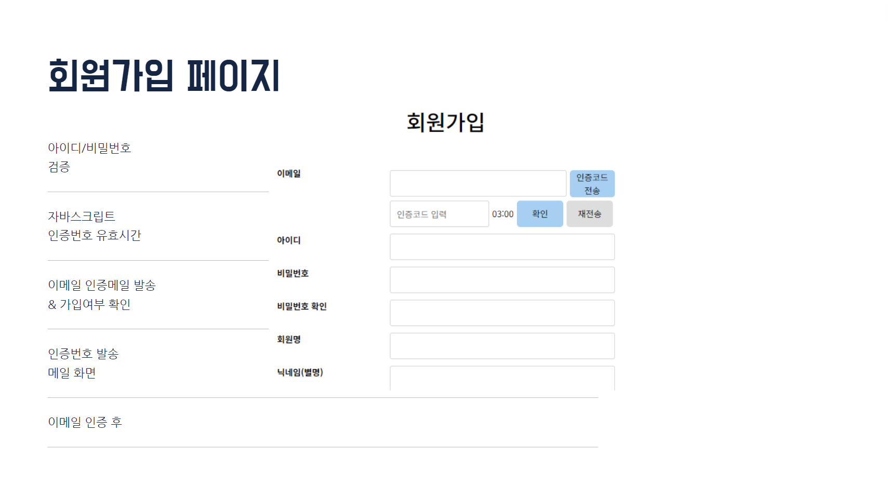
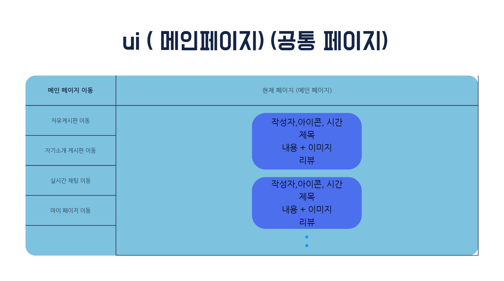
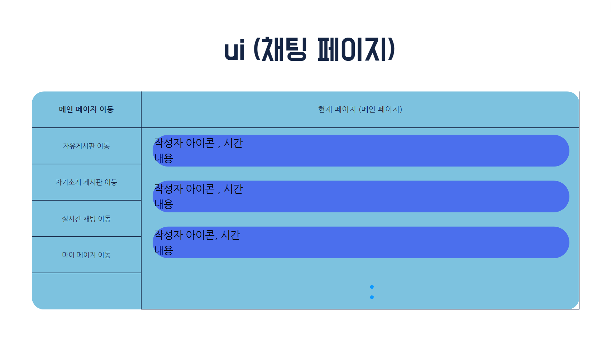

# 설정

- .prettierc

```json
{
  "singleQuote": true,
  "semi": true,
  "useTabs": false,
  "tabWidth": 2,
  "printWidth": 80,
  "trailingComma": "all"
}
```

- jsconfig.json

```json
{
  "compilerOptions": {
    "target": "ES6"
  }
}
```

# 의존성

- react-router-dom : 라우터
- sass, styled-components, classnames : 스타일링 목적
- @loadable/component : 지연로딩
- immer : 불변성 관리
- axios : ajax
- i18next, react-i18next : 메세지, 다국어 처리
- react-helmet-async : head 태그 내부 구성을 변경할때
- react-icons : 리액트에서 제공하는 아이콘 모음

```
yarn add react-router-dom sass styled-components classnames @loadable/component immer axios i18next react-i18next react-icons
```

```
npm i react-router-dom sass styled-components classnames @loadable/component immer axios i18next react-i18next react-icons
```

# 초기 구성 - src/index.js

- HelmetProvider
- BrowserRouter

# 화면구성

<br>
<br>
<br>
<br>
<br>

# 로그인 페이지

<br>

- 이메일 로그인
- 페스워드
- jwt 토큰 발급
- 회원가입
- 아이디, 비밀번호 찾기

# 회원가입 페이지

<br>

- 이메일 중복 확인, 이메일 인증
- 페스워드 복잡성 페스워드 확인
- 약정확인

# 자기소개 개시판

# 자유 게시판

<br>

- 게시물
- 작성자, 작성일 , 시간
- 작성 내용
- 이미지
- 댓글, 답글

# 실시간 채팅

<br>

- 작성자 아이콘,
- 실시간 채팅
- 내용 기록
- @푸쉬 알람
